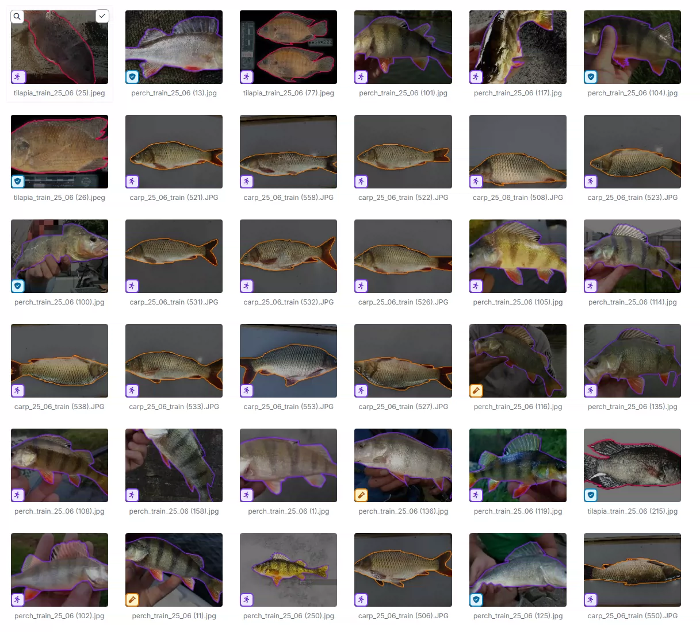
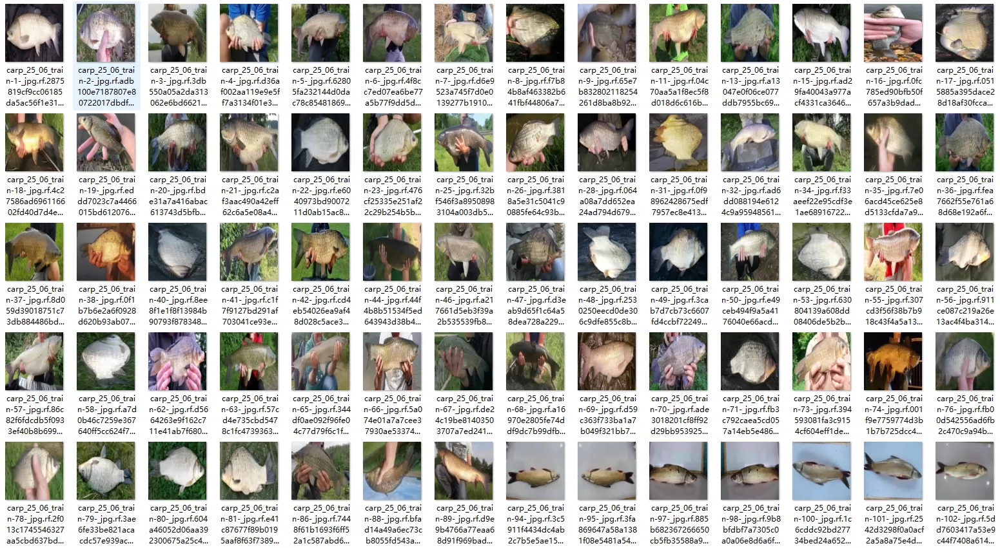
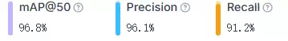
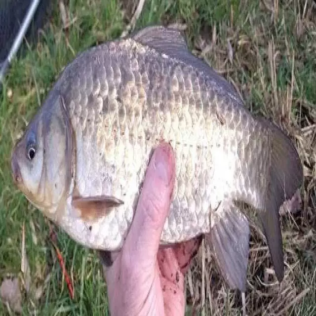
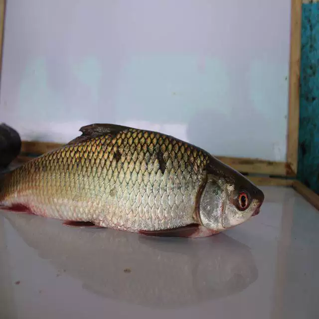
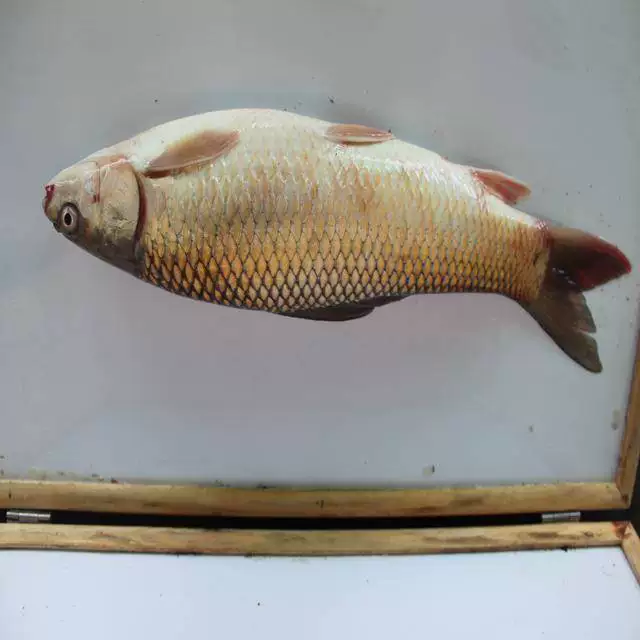
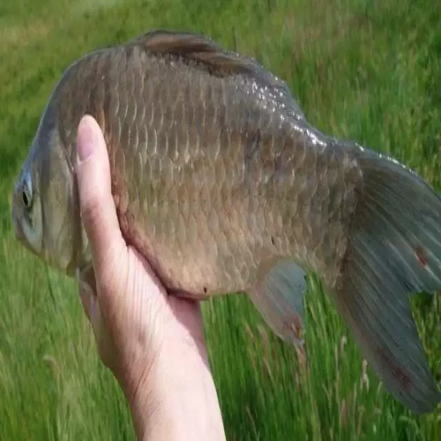

## Body

The target detection dataset for carp, catfish, perch, and tilapia in YOLO format.

Totally 2181 images are available, labeled with tags, and divided into training set, test set, and validation set.

The dataset is divided into 4 categories: carp', 'catfish', 'perch', 'tilapia'.

YOLOv8 weight file (training rounds 100, pre-trained model YOLOv8m.pt, mAP@50 0.979) with training results files.
YOLOv11 weight file (training rounds 100, pre-trained model YOLO11m.pt, mAP@50 0.971) with training results files.

Electronic virtual products sold without return or exchange.

## Images

item_1045197130801

Here is a pay link on Stripe ( https://buy.stripe.com/3cs8yP7sY87d0vu9AB ). Please contact me lonlonago@foxmail.com after funding $89, and I will send you a complete data files , thank you!

